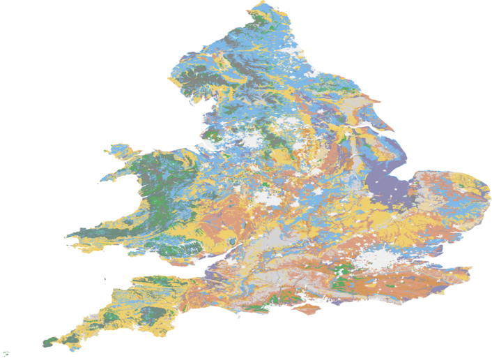

# Flood Risk Prediction Tool

## Overview

Flood risk is a significant concern, affecting both global and UK-based human settlements. Predicted climate changes suggest an increase in the frequency and severity of floods. Floods can occur from various sources such as surface water, rivers, and seas. To better assess and manage these risks, we have developed an efficient tool leveraging Machine Learning (ML) techniques.


<p align="center"><i> Picture taken by <a href="https://flickr.com/photos/60539443@N05/23675629939">J. Scott</a>, used under <a href="https://creativecommons.org/licenses/by/2.0/deed.en">CC-BY</a></i></p>

For a detailed synopsis and definitions, please refer to the `ProjectDescription.ipynb` file.

## Features of the Tool

- Based on an arbitrary postcode in London, the tool can provide:
  - Flood risk on a 10 point scale.
  - Estimate of the median house price.
- The tool estimates the Local Authority & flood risk for arbitrary locations.
- It can find the rainfall and water level near a given postcode using provided rainfall, river and tide level data, or by fetching the data from the [Met Office API](http://environment.data.gov.uk/flood-monitoring/data).

## Installation

This application requires Python 3.6 and above. Create a new Conda environment using the provided `environment.yml` file:

```bash
conda env create -f environment.yml
```

#### Note: PyQtWebEngine package does not work properly with Apple M1 chips. If possible, use a Mac with an Intel CPU.

## How it Works
The tool employs Pandas for preprocessing, Scikit-learn for prediction, Matplotlib and Folium for visualisation, and PyQt5 for the user interface.

Below are some links to visualisation examples:




## File/Folder Structure

preprocessing_tool: Contains functions used for preprocessing.
Extra (folder): Contains unused modules. See docstrings in files for more information.

## User Guide
Modelling (predictions):

risk label prediction method: {0: 'all_zero_risk', 1: knn_model}

house price prediction method: { 0: 'all_england_median', 1: knn_model, 2: ridge_model, 3: lasso_model}

local authority prediction method: { 0:'Do Nothing', 1: knn_model, 2: decisiontree_model, 3: random_forest_model}

Note: method = 1 is the best one in all methods More examples for running the models can be found in trainModels.ipynb.

Models are available for risk label, house price, and local authority prediction. Each model offers a few methods. Please note that method = 1 is recommended for all models. For more examples of running the models, refer to `trainModels.ipynb`.


## Data Visualisation (GUI Design)
The package used to create the GUI is PyQt5 (requires additional external packages). Remember, PyQtWebEngine package does not work properly with Apple M1 chips. Use a Mac with an Intel CPU instead.

There are two GUI tools available in the main folder: `CoordinateTool.py` and `GraphView.py`, and two folders used to provide input data: coordinate_file and result_file.

‘CoordinateTool.py’: the GUI converts latitude and longitude to easting and northing (and vice versa). It takes as input:

a single pair of values, or

a list of pairs of values. Note: this is done by uploading a csv file. For example, if ‘example.csv’ contains all the pairs of values, type ‘example’ in the input box. The user has to make sure the csv file only contains two columns (‘Latitude’ and ‘Longitude’, or ‘Easting’ and ’Northing’). The csv file should be stored in the ‘coordinate_file’ folder. There is an example in the folder to play with.

‘GraphView.py’: The GUI displays a data visualisation graph. The user should input a csv file (stored in the ‘result_file’ folder), with columns: ‘Latitude’, ‘Longitude’, ‘Risk Label’, ‘Property Median Price’, and ‘Risk Level’. The user can then choose different options to plot the graph they want. Note1: Due to the GUI power limitations, the GUI cannot deal with high-density data (it displays a white image). Therefore, the GUI displays at most 1000 data points in each plot. Note2: The plotting API has more functionalities that the GUI, see details in jupyter notebook (DataVisualization.ipynb).

#### Detailed usage for CoordinateTool.py and GraphView.py is provided in their respective sections.

#### To run GUIs, use the following commands:

```bash
python GraphView.py
python CoordinateTool.py
```

## Documentation and Report
Documentation can be found in the docs folder (see index.html). A project report is also located in the docs folder.

## Testing
The tool includes several tests to verify its functionality. Ensure you have pytest installed, and run the tests with the following command:

```bash
python -m pytest --doctest-modules flood_tool
```

## Reading List
 - A Guide to Coordinate Systems in Great Britain  [https://webarchive.nationalarchives.gov.uk/20081023180830/http://www.ordnancesurvey.co.uk/oswebsite/gps/information/coordinatesystemsinfo/guidecontents/index.html]
 - Information on Postcode Validity[https://assets.publishing.service.gov.uk/government/uploads/system/uploads/attachment_data/file/283357/ILRSpecification2013_14Appendix_C_Dec2012_v1.pdf]